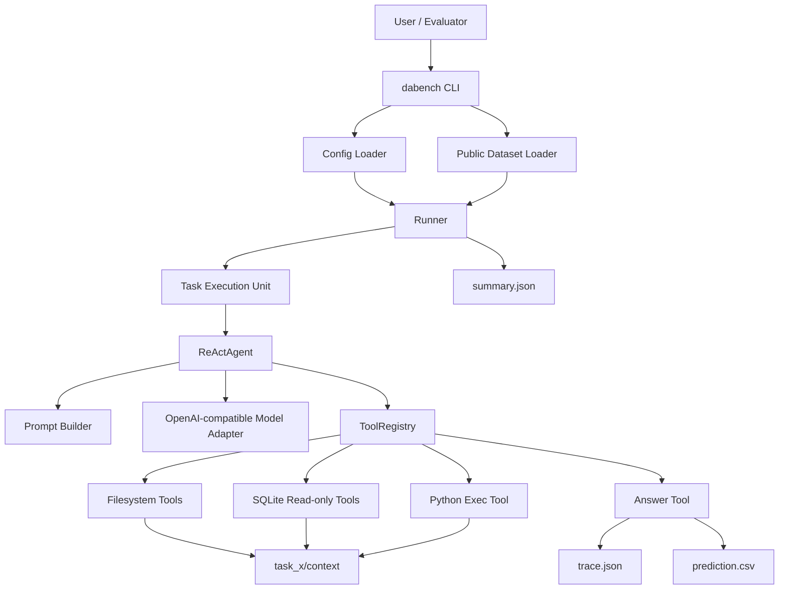

# 系统架构设计

以下内容基于当前仓库快照中的 `pyproject.toml`、`README.md`、`README.zh.md`、`data/public/README.md`、`configs/react_baseline.example.yaml` 以及 `src/data_agent_baseline/` 核心源码分析整理。

## 1. 项目简介 (About)

这是 KDD Cup 2026 DataAgent-Bench 的官方 Python baseline。它从本地任务数据集中读取题目和上下文数据，驱动一个 ReAct 风格的 LLM 代理，通过受控工具访问 CSV、JSON、Markdown、SQLite 等任务资产，最终生成 `prediction.csv` 与 `trace.json`，供后续评测使用。

当前仓库内置了 50 个公开 demo 任务，公开数据集难度分布为 `easy=15`、`medium=23`、`hard=10`、`extreme=2`。具体评分逻辑不在本仓库内，属于 `[待补充: 官方评测实现]`。

## 2. 技术栈 (Tech Stack)

- 语言：Python `>=3.10`
- 构建与包管理：PEP 621 `pyproject.toml`、Hatchling、`uv`、`uv.lock`
- 命令行框架：Typer
- 终端展示：Rich
- LLM 接入：OpenAI Python SDK `openai>=2.28.0`
- 配置解析：PyYAML
- 本地数据处理：标准库 `json`、`csv`、`sqlite3`、`pathlib`
- 并发与隔离：`ThreadPoolExecutor`、`multiprocessing`
- 预装数据分析依赖：`pandas`、`polars`、`pyarrow`、`duckdb`、`numpy`、`openpyxl`、`datasets`、`huggingface-hub`、`pydantic`

说明：

- 当前 core 框架代码直接使用的主要依赖是 `openai`、`typer`、`rich`、`pyyaml`，其余数据分析库在 `src/` 中未直接 `import`，更可能用于 `execute_python` 工具的分析执行环境或后续扩展。
- 该项目不是前后端 Web 应用，也不是 Android / Gradle 项目；仓库中不存在 `package.json`、`requirements.txt`、`build.gradle` 等对应工程文件。
- 代码默认模型配置为 `gpt-4.1-mini` + `https://api.openai.com/v1`，而当前示例 YAML 覆盖为另一个 OpenAI-compatible 服务配置。

## 3. 核心特性 (Features)

- 基于任务目录自动发现并校验基准任务，统一读取 `task.json` 与 `context/`
- 使用 ReAct 循环驱动模型决策，模型输出必须满足固定的 JSON action 协议
- 提供多种本地工具能力，支持目录浏览、CSV/JSON/文档预览、SQLite 只读查询、Python 代码执行
- 支持单任务运行与多任务并发基准运行，并具备任务级超时隔离能力
- 自动落盘可追踪产物，包括 `trace.json`、`prediction.csv` 和批量运行汇总 `summary.json`

## 4. 架构设计与核心逻辑 (Architecture & Core Logic)

### 4.1 模块划分与职责

- 配置层：`src/data_agent_baseline/config.py`
  - 加载 YAML 配置
  - 解析数据集路径、模型参数、输出目录、并发数、超时时间
  - 将配置映射为 `AppConfig`、`DatasetConfig`、`AgentConfig`、`RunConfig`
- 入口层：`src/data_agent_baseline/cli.py`
  - 提供 `status`、`inspect-task`、`run-task`、`run-benchmark` 四个命令
  - 负责用户输入解析、状态展示、运行编排入口
- 数据集层：`src/data_agent_baseline/benchmark/`
  - `schema.py` 定义 `PublicTask`、`TaskRecord`、`TaskAssets`、`AnswerTable`
  - `dataset.py` 负责发现任务目录、读取 `task.json`、校验任务结构
- Agent 层：`src/data_agent_baseline/agents/`
  - `prompt.py` 生成 system prompt、task prompt、observation prompt
  - `model.py` 封装 OpenAI-compatible 模型调用
  - `react.py` 实现 ReAct 主循环、模型响应解析、步骤推进
  - `runtime.py` 定义运行时状态、步骤记录、运行结果对象
- 工具层：`src/data_agent_baseline/tools/`
  - `registry.py` 负责工具注册、提示词描述拼装、统一分发
  - `filesystem.py` 提供 `list_context`、`read_csv`、`read_json`、`read_doc`
  - `sqlite.py` 提供 `inspect_sqlite_schema`、`execute_context_sql`
  - `python_exec.py` 提供 `execute_python`
  - `answer` 工具负责提交最终表格并终止任务
- 运行编排层：`src/data_agent_baseline/run/runner.py`
  - 创建 `run_id` 与输出目录
  - 执行单任务或批量任务
  - 处理并发、超时、失败兜底、结果写盘与汇总

### 4.2 核心业务执行链路

#### 4.2.1 单任务运行链路

1. 用户执行 `uv run dabench run-task <task_id> --config PATH`。
2. CLI 通过 `load_app_config()` 读取 YAML，得到数据集、模型、运行配置。
3. `create_run_output_dir()` 创建本次运行目录 `artifacts/runs/<run_id>/`。
4. `DABenchPublicDataset.get_task()` 读取 `task_<id>/task.json` 并定位 `context/`。
5. `runner` 构造 `OpenAIModelAdapter`、`ToolRegistry` 和 `ReActAgent`。
6. `ReActAgent` 生成 system prompt 和 task prompt，请求模型输出一个 fenced JSON。
7. `parse_model_step()` 解析模型响应中的 `thought`、`action`、`action_input`。
8. `ToolRegistry.execute()` 根据 `action` 调用具体工具。
9. 工具返回 observation，Agent 将 observation 追加到对话历史中，继续下一轮推理。
10. 当模型调用 `answer` 工具时，系统构造 `AnswerTable` 并终止当前任务。
11. `runner` 将完整轨迹写入 `trace.json`；若存在答案，则额外写出 `prediction.csv`。

#### 4.2.2 批量运行链路

1. 用户执行 `uv run dabench run-benchmark --config PATH [--limit N]`。
2. `runner.run_benchmark()` 遍历公开数据集中的任务列表。
3. 若 `max_workers > 1` 且未注入自定义模型或工具，则通过 `ThreadPoolExecutor` 并发运行多个任务。
4. 每个任务内部仍通过独立流程执行，并可在需要时使用子进程做任务级超时隔离。
5. 每个任务结束后回调 CLI 进度条，刷新成功数、失败数、速率与最近完成任务。
6. 全部任务完成后写出 `summary.json` 汇总。

### 4.3 Mermaid 核心架构图



### 4.4 关键设计约束

- 文件访问边界
  - 所有文件路径都必须相对 `context/`
  - `resolve_context_path()` 会阻止路径越界访问
- SQL 安全边界
  - 仅允许 `SELECT`、`WITH`、`PRAGMA` 开头的只读 SQL
  - SQLite 以只读 URI 方式连接
- Python 执行隔离
  - `execute_python` 在独立子进程中运行
  - 固定 30 秒超时
  - 自动捕获 `stdout`、`stderr` 和异常堆栈
- 任务级容错
  - 批量运行时单个任务失败不会中断全局流程
  - 超时、异常退出、空结果都会写入失败原因
- 结果可追踪
  - 每一步模型原始响应、动作、参数、工具观测都会进入 `trace.json`

### 4.5 任务上下文数据形态

根据 `data/public/README.md` 与公开 demo 数据目录，任务上下文通常由以下一种或多种数据构成：

- `csv/`：结构化 CSV 文件
- `json/`：结构化 JSON 文件
- `db/`：SQLite / DB 文件
- `doc/`：文本文档或 Markdown
- `knowledge.md`：补充背景知识文档

实际公开 demo 中可见的非 `task.json` 文件扩展名主要包括：

- `.md`
- `.csv`
- `.json`
- `.db`

## 5. 目录结构说明 (Directory Structure)

```text
kddcup2026-data-agents-starter-kit/
├── pyproject.toml
├── uv.lock
├── README.md
├── README.zh.md
├── configs/
│   └── react_baseline.example.yaml
├── data/
│   └── public/
│       ├── README.md
│       ├── input/
│       │   └── task_<id>/
│       │       ├── task.json
│       │       └── context/
│       │           ├── csv/            # 可选
│       │           ├── db/             # 可选
│       │           ├── json/           # 可选
│       │           ├── doc/            # 可选
│       │           └── knowledge.md    # 可选
│       └── output/
│           └── task_<id>/
│               └── gold.csv
├── artifacts/
│   └── runs/
│       └── <run_id>/
│           ├── summary.json
│           └── task_<id>/
│               ├── trace.json
│               └── prediction.csv
├── assets/
│   └── HKUSTGZ_DIAL.jpg
└── src/
    └── data_agent_baseline/
        ├── __init__.py
        ├── cli.py
        ├── config.py
        ├── agents/
        │   ├── __init__.py
        │   ├── model.py
        │   ├── prompt.py
        │   ├── react.py
        │   └── runtime.py
        ├── benchmark/
        │   ├── __init__.py
        │   ├── dataset.py
        │   └── schema.py
        ├── run/
        │   ├── __init__.py
        │   └── runner.py
        └── tools/
            ├── __init__.py
            ├── filesystem.py
            ├── python_exec.py
            ├── registry.py
            └── sqlite.py
```

目录说明：

- `configs/`：运行参数示例配置
- `data/public/input/`：公开 demo 输入任务目录
- `data/public/output/`：公开 demo 标准答案目录，仅用于公开样例比对
- `artifacts/runs/`：运行产物目录
- `src/data_agent_baseline/agents/`：代理推理与模型封装
- `src/data_agent_baseline/benchmark/`：任务定义与数据集加载
- `src/data_agent_baseline/run/`：执行调度与产物写出
- `src/data_agent_baseline/tools/`：工具能力实现

补充说明：

- 当前仓库没有项目级 `tests/` 目录。
- `__pycache__`、`.git`、`.venv` 等目录不属于核心业务目录，已在本说明中省略。

## 6. 快速开始 (Quick Start)

### 6.1 环境依赖

- Python `>=3.10`
- `uv` 包管理工具
- 一个可访问的 OpenAI-compatible API 服务
- 本地公开数据集目录，默认路径为 `data/public/input`

说明：

- 当前代码没有通过环境变量自动读取 API Key 的逻辑，`api_key` 直接来自 YAML 配置文件。
- 当前代码没有独立的数据库服务、消息队列或 Web 服务依赖。

### 6.2 配置文件

建议基于 `configs/react_baseline.example.yaml` 填写本地配置：

```yaml
dataset:
  root_path: data/public/input

agent:
  model: [待补充: 你的模型名称]
  api_base: [待补充: 你的 OpenAI-compatible API Base]
  api_key: [待补充: 你的 API Key]
  max_steps: 16
  temperature: 0.0

run:
  output_dir: artifacts/runs
  run_id:
  max_workers: 8
  task_timeout_seconds: 600
```

字段说明：

- `dataset.root_path`：输入任务根目录
- `agent.model`：模型名称
- `agent.api_base`：兼容 OpenAI 的 API 根地址
- `agent.api_key`：API 访问密钥
- `agent.max_steps`：单任务最大 ReAct 步数
- `agent.temperature`：采样温度
- `run.output_dir`：运行产物输出目录
- `run.run_id`：本次运行目录名，不填时自动生成 UTC 时间戳
- `run.max_workers`：批量运行并发数
- `run.task_timeout_seconds`：单任务墙钟超时秒数

### 6.3 安装依赖

```bash
uv sync
```

### 6.4 本地运行命令

查看帮助：

```bash
uv run dabench --help
```

检查项目状态与数据集可见性：

```bash
uv run dabench status --config configs/react_baseline.example.yaml
```

查看单个任务信息：

```bash
uv run dabench inspect-task task_11 --config configs/react_baseline.example.yaml
```

运行单个任务：

```bash
uv run dabench run-task task_11 --config configs/react_baseline.example.yaml
```

运行批量 benchmark：

```bash
uv run dabench run-benchmark --config configs/react_baseline.example.yaml
```

限制 benchmark 任务数：

```bash
uv run dabench run-benchmark --config configs/react_baseline.example.yaml --limit 5
```

### 6.5 输出产物

单任务输出目录结构：

```text
artifacts/runs/<run_id>/task_<id>/
├── trace.json
└── prediction.csv
```

批量运行额外输出：

```text
artifacts/runs/<run_id>/
└── summary.json
```

说明：

- 若任务失败，通常仍会生成 `trace.json`，但可能不生成 `prediction.csv`
- `summary.json` 中包含成功任务数、任务列表和每个任务的产物路径

## 7. 已知边界与待补充项

- `[待补充: 官方评测脚本或评分逻辑]`
- `[待补充: hidden test 数据接入方式]`
- `[待补充: 更严格的 Python 执行沙箱策略]`
- `[待补充: 模型限流、重试、断点续跑等生产级能力]`
- `[待补充: 自定义工具扩展规范与插件机制]`

